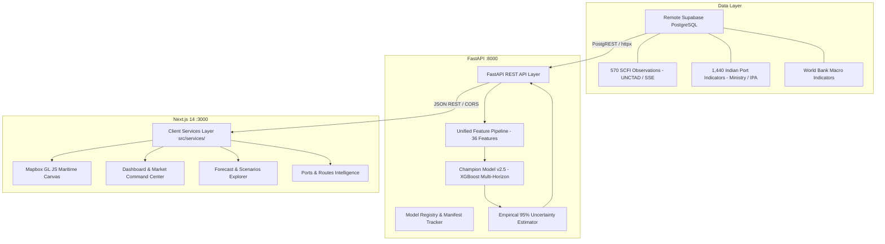

# FreightSense 2.0: AI-Powered Maritime Intelligence & Freight-Rate Forecasting

FreightSense 2.0 is an enterprise-grade maritime intelligence, supply-chain risk monitoring, and container freight-rate forecasting platform. Built for global logistics operators, port authorities, and supply chain analysts, it unifies authoritative international freight indices, national port operational indicators, macroeconomic drivers, and leak-free machine learning to deliver calibrated multi-horizon rate projections.

---

## 1. Project Overview

Global container shipping is subject to high volatility driven by geopolitical chokepoint disruptions (e.g. Red Sea Cape of Good Hope rerouting), seasonal demand swings, port congestion, and macro cycle shifts. FreightSense 2.0 addresses this complexity through:
- **Calibrated Multi-Horizon Forecasting**: 1-week (7D), 2-week (14D), and 4-week (28D/30D) container freight rate estimates with empirical 95% uncertainty intervals.
- **Geospatial Intelligence (Mapbox GL JS)**: Interactive visual maritime basemap tracking international tradelanes, major global gateway hubs, East Coast Indian major ports, simulated AIS vessel positions, and weather hazard advisories.
- **Operational Port Telemetry**: Integrated operational performance metrics (dwell time, berth occupancy, vessel turnaround, cargo throughput) across major Indian maritime hubs.
- **Executive Command Center**: Live telemetry dashboards, macro driver monitoring, corridor volatility trackers, and grounded AI insights.

---

## 2. Architecture



---

## 3. Technology Stack

- **Frontend**: Next.js 14 (App Router), React 18, TypeScript, Tailwind CSS, Recharts, Lucide React, Mapbox GL JS (`mapbox-gl`).
- **Backend**: FastAPI, Uvicorn, Pydantic v2, HTTPX, Scikit-Learn, XGBoost, LightGBM, Pandas, NumPy, Joblib.
- **Database**: Remote Supabase (PostgreSQL 15 with Row-Level Security and PostgREST API).
- **Deployment**:
  - Frontend: Vercel
  - Backend & ML Engine: Render (Containerized with Docker or Python Web Service)
  - Database: Supabase Cloud

---

## 4. Database Schema & Supabase Configuration

The application is backed by 51 relational tables in Supabase. Primary tables include:
- `freight_market_observations`: 570 weekly observations covering 3 core corridors (`route-sha-rot`, `route-sha-lax`, `route-rot-nyc`) from `2021-01-08` to `2024-08-23`.
- `historical_observations`: 2,016 normalized observations (1,440 Indian port metrics, 570 SCFI points, 6 World Bank annual GDP records).
- `ports`: 11 major global gateway and Indian east coast ports with official Ministry operational indicators.
- `routes`: Verified international corridors with nautical mile distances, transit times, and spot benchmark references.
- `data_source_registry`: Metadata tracking update frequency, coverage, and license requirements.

---

## 5. Data Sources & Lineage

1. **Shanghai Containerized Freight Index (SCFI) / UNCTAD**: Primary historical forecasting target covering Asia-Europe, Transpacific, and Transatlantic tradelanes.
2. **Ministry of Ports, Shipping and Waterways / Indian Ports Association (IPA)**: Operational indicators across 6 Major Indian Ports on the East Coast (Paradip, Visakhapatnam, Kamarajar, Chennai, Tuticorin, SPM Kolkata/Haldia).
3. **World Bank Open Data**: Macroeconomic GDP annual step indicator.
4. **Commercial / Licensed Providers**:
   - Baltic Exchange (FBX): Flagged as `LICENSE REQUIRED` unless proprietary credentials are configured.
   - Satellite AIS Telemetry: Marked as demonstration / simulation unless commercial MarineTraffic/Spire credentials are provided.

---

## 6. Machine Learning Pipeline & Zero-Leakage Architecture

- **Target Variable**: Weekly spot container freight rate delta $\Delta_{t+h} = y_{t+h} - y_t$.
- **Explanatory Maritime Features**: 36 features across:
  - Backward lags (1W, 2W, 4W, 8W, 12W)
  - Rolling statistics (4W, 8W, 12W means and standard deviations computed on shifted data)
  - Rate momentum and volatility ratios
  - Calendar seasonality (quarter, month, cyclical week sine/cosine, Q3 peak flag, Q4 inventory frontloading)
  - One-hot corridor indicators
  - 10 Indian port monthly operational features
  - Annual macro GDP growth step function
- **Temporal Alignment**:
  - Chronological 70% Train (`2021-01-15` to `2023-07-14`), 15% Val (`2023-07-21` to `2024-01-26`), 15% Test (`2024-02-02` to `2024-08-16`).
  - Zero Look-Ahead Bias: Indian monthly port data for month $M$ is aligned with publication lag ($M + 1\text{ month}$). Scalers fit strictly on the training partition.

---

## 7. Model Information & Test Benchmark Leaderboard

**Active Champion**: `v2.5` (`XGBoost Multi-Horizon Delta Estimator + Empirical 95% Uncertainty`).

### Test Set Performance Evaluation (Held-Out Red Sea Disruption Period):

| Horizon | Model | MAE (USD) | RMSE (USD) | MAPE | $R^2$ | Directional Acc |
| :--- | :--- | :--- | :--- | :--- | :--- | :--- |
| **1-Week (7D)** | Naive Baseline | $106.52 | $129.56 | 3.26% | 0.983 | 0.0% |
| | **XGBoost (Champion v2.5)** | **$43.41** | **$61.22** | **1.33%** | **0.996** | **95.4%** |
| **2-Week (14D)** | Naive Baseline | $158.74 | $191.77 | 4.86% | 0.962 | 1.1% |
| | **XGBoost (Champion v2.5)** | **$71.05** | **$97.37** | **2.19%** | **0.990** | **95.4%** |
| **4-Week (28D)** | Naive Baseline | $264.68 | $314.61 | 8.12% | 0.898 | 0.0% |
| | **XGBoost (Champion v2.5)** | **$124.48** | **$178.42** | **3.87%** | **0.967** | **97.7%** |

---

## 8. API Specifications

The FastAPI ML backend exposes RESTful endpoints under `/api/v1`:
- `GET /api/v1/health`: Liveness probe and champion model version.
- `GET /api/v1/data-quality`: Data gate metrics and source health.
- `GET /api/v1/forecasts`: Multi-horizon rate prediction with 95% empirical intervals.
- `GET /api/v1/forecasts/{route_id}`: Corridor-specific projection series.
- `POST /api/v1/forecasts/generate`: Dynamic parameter scenario simulation.
- `GET /api/v1/forecasts/history`: Out-of-time evaluation points with residuals.
- `GET /api/v1/forecasts/models`: Registry manifest, feature hash, and leaderboard.
- `GET /api/v1/markets`: 570 SCFI observations compiled into 4 time series indices.
- `GET /api/v1/markets/drivers`: Authoritative macroeconomic and route drivers.
- `GET /api/v1/ports`: Operational indicators for 6 Indian major ports + 5 global hubs.
- `GET /api/v1/routes`: Primary shipping tradelanes, distances, and spot rates.
- `GET /api/v1/signals`: Market leading signals and sentiment telemetry.
- `GET /api/v1/alerts`: Real-time risk alerts based on capacity and volatility thresholds.
- `GET /api/v1/insights`: Grounded domain commentary generated from model forecasts.
- `GET /api/v1/dashboard/summary`: Consolidated executive KPI metrics.

---

## 9. Frontend Setup & Pages

Next.js 14 frontend routes:
- `/dashboard`: Executive command center with live rate metrics and KPI cards.
- `/market`: Freight market intelligence powered by 570 verified SCFI records.
- `/forecast`: Multi-corridor and multi-horizon projection engine with 95% uncertainty ribbon.
- `/map`: Geographic maritime basemap (Mapbox GL JS) with routes, ports, vessels, and weather layers.
- `/routes`: Tradelane corridor benchmarking, transit distances, and capacity status.
- `/ports`: Operational port performance tracking (dwell, berth utilization, throughput).
- `/signals`: Market leading signals and geopolitical disruption indices.
- `/alerts`: Dynamic risk alerts.
- `/insights`: Domain reasoning conditioned on model projections.

---

## 10. Environment Variables Checklist

Copy `.env.example` to `.env.local` for frontend and `services/ml-api/.env` for backend:

```bash
# Supabase Configuration
NEXT_PUBLIC_SUPABASE_URL=https://your-project.supabase.co
NEXT_PUBLIC_SUPABASE_ANON_KEY=your-anon-key
SUPABASE_SERVICE_ROLE_KEY=your-service-role-key-server-only

# FastAPI Backend
FASTAPI_BASE_URL=http://localhost:8000
NEXT_PUBLIC_FASTAPI_BASE_URL=http://localhost:8000
API_INTERNAL_SECRET=your-secret-internal-key
ALLOWED_ORIGINS=http://localhost:3000,http://127.0.0.1:3000,https://freightsense.vercel.app

# Mapbox Geospatial Visualization
NEXT_PUBLIC_MAPBOX_TOKEN=pk.your-mapbox-public-token-here

# ML Pipeline
DEFAULT_MODEL_VERSION=v2.5
MODEL_REGISTRY_BUCKET=freightsense-models
MODEL_ARTIFACT_BASE_PATH=artifacts/models
RETRAINING_ENABLED=false
```

---

## 11. Local Development Quickstart

### Prerequisites
- Node.js 18+ and npm
- Python 3.11
- Virtualenv

### 1. Start FastAPI ML Backend
```bash
cd services/ml-api
python3 -m venv .venv
source .venv/bin/activate
pip install -r requirements.txt
cp .env.example .env
# Edit .env with Supabase credentials
PYTHONPATH=. uvicorn app.main:app --port 8000 --reload
```

### 2. Start Next.js Frontend
```bash
# In project root
npm install
cp .env.example .env.local
# Edit .env.local with Supabase & Mapbox credentials
npm run dev
# Open http://localhost:3000
```

---

## 12. Production Deployment Guide

### A. Deploy Backend to Render
1. Connect your repository to Render.
2. Select **Web Service** using `render.yaml` or Docker:
   - Root Directory: `services/ml-api`
   - Build Command: `pip install -r requirements.txt`
   - Start Command: `uvicorn app.main:app --host 0.0.0.0 --port $PORT --workers 2`
3. Configure environment variables (`SUPABASE_URL`, `SUPABASE_ANON_KEY`, `ALLOWED_ORIGINS`, `API_INTERNAL_SECRET`).

### B. Deploy Frontend to Vercel
1. Import repository to Vercel.
2. Framework Preset: **Next.js**.
3. Set Environment Variables:
   - `NEXT_PUBLIC_FASTAPI_BASE_URL`: URL of deployed Render backend.
   - `NEXT_PUBLIC_SUPABASE_URL`: Your Supabase URL.
   - `NEXT_PUBLIC_SUPABASE_ANON_KEY`: Your Supabase Anon Key.
   - `NEXT_PUBLIC_MAPBOX_TOKEN`: Your Mapbox public access token.
4. Deploy!

---

## 13. Known Limitations

1. **Satellite AIS Vessel Tracking**: Real-time global vessel positions require an enterprise satellite API subscription (MarineTraffic, Spire). In the current demonstration version, vessel positions are simulated along corridor waypoints.
2. **Doppler Radar Weather Feeds**: Live NEXRAD/cyclone radar tiles require a dedicated weather tile server; current storm alerts represent simulated meteorological advisories.
3. **Licensed Benchmarks**: Proprietary indices (Baltic Exchange FBX) require commercial licensing credentials.

---

## 14. Smart India Hackathon (SIH) Data & Claim Grounding

1. **Target Variable**: The Shanghai Containerized Freight Index (SCFI) on three primary East-West tradelanes is the sole freight-rate forecasting target.
2. **Indian Maritime Data**: Datasets from the Indian Ports Association and Ministry of Ports, Shipping and Waterways represent **explanatory operational features and port operational indicators**. The system does **not** claim to predict India-specific container freight rates.
3. **Historical Ground Truth**: Telemetry and backtest leaderboards derive strictly from verified historical observations without synthetic interpolation.
